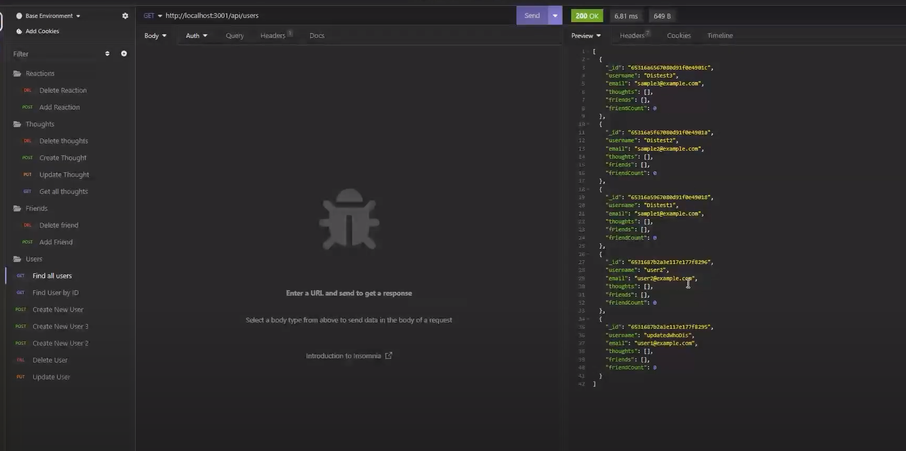

# Zuckerberg
An API for a social network web application where users can share their thoughts, react to friends’ thoughts, and create a friend list.

## Table of Contents

- [Description](#description)
- [Technology](#Technology)
- [Installation](#installation)
- [Usage](#usage)
- [License](#license)
- [Questions](#questions)

## Description:

It's an API for a social network web application where users can share their thoughts, react to friends’ thoughts, and create a friend list.

## Technology:

Project is created with:

- Javascript
- Node.js
- Express.js
- MongoDB
- Mongoose

## Installation

To run this project, install it locally using npm:

    - npm init -y
    - npm i express
    - npm i mongoose
    - npm i moment
    - npm i dotenv

## Usage

After installing npm packages, the application will be invoked by using the following command:

* Start the server by running node server.js in your terminal.
* Access the API routes using a tool like Insomnia or Postman.
* Routes include user, thought, and reaction management.

 * Video
 https://www.youtube.com/watch?v=JfdhcFKnfRw

 * Screenshot 
 

 ## License

  
This project is licensed under MIT, for more information please visit [this website](https://opensource.org/licenses/MIT)

## Questions
For any questions or concerns, please reach out to me through the following contact information:

- Github: [DntTstMe](https://github.com/DntTstMe)
- Email: lex.tester93@gmail.com
